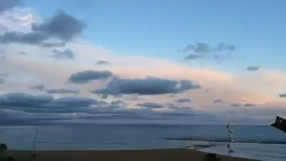
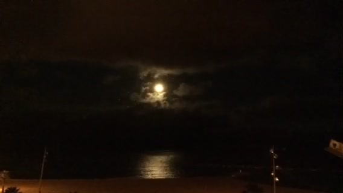
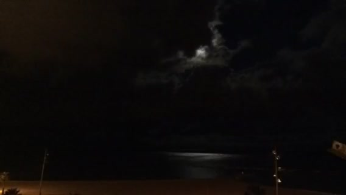
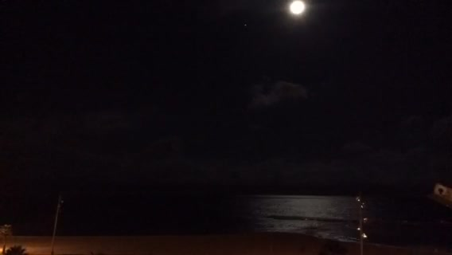
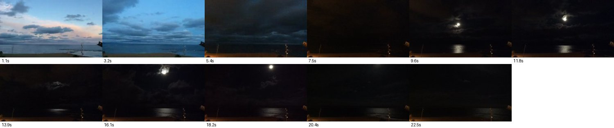

# 🎬 Video frames and a PDF photobook, from one real clip

> **"With the upload of the files, Claude works through the videos frame by frame. Is there a way to make this work similar as well?"** Someone asked this in [issue #15](https://github.com/drolosoft/immich-photo-manager/issues/15), and versions 1.6.0 to 1.11.0 came out of that conversation. This page runs the whole flow on one real video, prompt by prompt, against Immich 2.7.5 and 3.1.0 with the same lab that lives in [`tests/live/`](../../tests/live/).

## The test video

[`luna.mov`](assets/12/luna.mov) (1.7 MB, 24 seconds, shot on an iPad from a balcony in Barcelona): a time-lapse that starts at sunset, goes dark, and then the moon rises between clouds over the sea. Short, but it changes completely from start to end, which is exactly what a single poster thumbnail cannot show. Immich keeps one poster per video and no per-frame previews; the plugin downloads the file through the Immich API and cuts the frames on your machine.

## 1. Look at the video

```
What happens in the video luna.mov?
```

Claude finds the asset and calls `get_video_frames` with the default 6 frames. Each frame is one image in the conversation (~1.6k tokens as a thumbnail), so the default stays small. These are the kind of frames it gets, evenly spaced — and each slot picks the liveliest frame in its own neighbourhood, so a black or dead moment at the exact centre never wastes a slot:

<p align="center">
   
</p>

> A time-lapse from a balcony over a beach: sunset with pink clouds, then dusk, then the moon rises between clouds and lights a path on the sea before leaving the frame at the top.

## 2. Skim a long video cheaply

For a five-minute video, sixty frames as sixty images would flood the context. Ask for a contact sheet instead:

```
Skim that video: one frame every 2 seconds, as a contact sheet
```

`get_video_frames(interval=2, sheet=true)` packs everything into grid images, 30 frames per sheet with the timestamp burned under each, so the whole skim costs one or two images:

<p align="center"></p>

## 3. Zoom into a moment

```
Cut 8 frames between second 8 and 12
```

`start`/`end` narrow the segment; `interval=1` goes down to one frame per second. Above 12 frames the tool answers with a plan (`frames_planned`, `estimated_tokens`) instead of extracting, so the user decides before the tokens are spent. The hard cap is 120 frames per call. Vertical phone videos come out upright: phones store them sideways with a rotation flag, and the plugin applies it (1.8.0).

## 4. The PDF photobook

```
Make a PDF photobook of this video. Pick the best moments and caption each one.
```

Before building anything, Claude can ask how you want it: `get_export_preview` returns every choice `export_pdf` accepts (layout, cover pages, which video moments, captions, image quality, language...) with its default, so when you just say "a PDF" it knows what to ask — and when you already gave specs, or answer "defaults are fine", it exports directly. Everything is also settable in one prompt: *"photobook, no cover or index, moments at 1s, 8.8s and 18.7s, one caption per moment, in Spanish"*.

Then Claude looks at the frames, chooses the moments (`frame_times`), writes the captions, and `export_pdf` builds the file on your machine — the PDF never enters the conversation:

- `layout="photobook"`: full-page images, fitted without cropping (letterbox, never a crop that cuts edges off). A video with several chosen frames unfolds into **one full page per frame**, each with its timestamp and its own caption (`frame_captions`) — the clip reads like a photo story. For [`luna.mov`](assets/12/luna.mov) that is five pages: sunset, dusk, the moon appearing, the moon high over the water, and gone.
- `layout="detail"` keeps the compact look instead: one page per asset with a frame strip (timestamps under each frame) and the metadata block.
- The `cover`, `index` and `places` pages can each be turned off, the footer can shrink to just the page number or disappear (`footer="pages"` / `"none"`), and a small title header on every page is available (`header=true`) — a print-ready photobook can be bare pages only.
- Frames that go into the PDF cost no tokens, up to 120 per video, and quality there is free: frames go in at preview size (1440px) and photos at the stored file's quality (capped at 3000px) by default.
- Albums read oldest to newest, like the frames inside a video, and a hand-picked selection mixing videos months apart asks for confirmation first (your own albums export as they are), one story per PDF. Live Photos count once, `language="es"` prints the page labels in Spanish, and the Places page draws an OpenStreetMap map on its own whenever the assets carry GPS (`map=false` to keep everything local).

The result for this clip: [`luna-photobook.pdf`](assets/12/luna-photobook.pdf) — the five moon pages, each with its caption.

## 5. The complete album report

```
Make a complete PDF of the album "A moon evening": the video first with its frames,
then every photo in order, one caption each, title on every page.
```

The everything-on use case: the same clip plus eight stills of the evening in one album, exported with the defaults doing the work. The video opens the document as a six-frame strip (`videos_position="first"`), each slot picking the liveliest frame of its neighbourhood; the photos follow oldest to newest, at the stored file's quality, each with its caption; the Places page draws the map on its own from the GPS; the title repeats on every page (`header=true`).

The result: [`moon-evening-report.pdf`](assets/12/moon-evening-report.pdf) — 12 pages, built by the published package against a real Immich, untouched.

## What leaves your network

The video goes from Immich to the machine running the plugin, where the frames are cut. Only the frames the model looks at reach the Claude API, like any photo it already handles. The PDF stays on disk unless you ask for it in base64. When the assets carry GPS, the Places page fetches map tiles from tile.openstreetmap.org (the only third-party call); `map=false` turns that off.

---

*Every claim above runs in the live kit: [`tests/live/`](../../tests/live/) drives all 57 tools against real Immich 2.7.5 and 3.1.0 before each release.*
